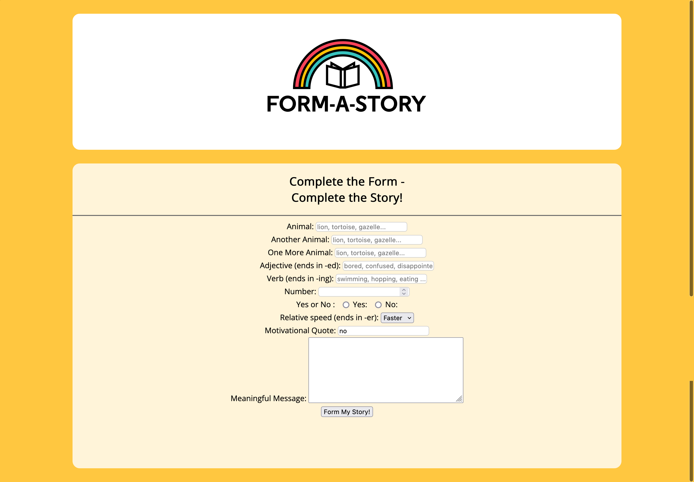

# FORM

## Table of contents

- [✅ Project completed](#project-completed-repo)
- [⌛️ Project starter](#project-starter-repo)
- [🧩 Concepts](#concepts-to-review-for-this-project)
- [🎯 Learning goal](#learning-goal)
- [💻 Application Overview](#overview)
  - [📸Screenshot](#screenshot)
  - [🥷🏽 The challenge](#the-challenge)
  - [🔗Links](#links)
- [🪜 My process](#my-process)
- [📕 What I learned](#what-i-learned)
- [⏭️ Continued development](#continued-development)
- [📚 Useful resources](#useful-resources)

## Project completed repo

- check out the code here `->` [completed](https://github.com/hermkan/code-journey-html/tree/main/02-form/completed)

## Project starter repo

- check out the code here `->` [starter](https://github.com/hermkan/code-journey-html/tree/main/02-form/starter)

## Concepts to review for this project

## Learning Goal

- Apply knowledge of the HTML `<form>` element and grab user input to tell a story

## Overview

### Screenshot

### The challenge

The challenge is to make a `<form>` capable of collecting the correct information so that the newly crafted story makes sense!.

The logic for parsing and inserting of user inputs is already taken care of in `main.js` using JavaScript. Some styling was also added to the page in `style.css`

### Links

- Live Site URL: [Form A Story](https://code-journey-html-form.vercel.app/)

## My process

### Built with

- Semantic HTML5 markup
- CSS custom properties

#### What I learned

#### Continued development

#### Useful resources
